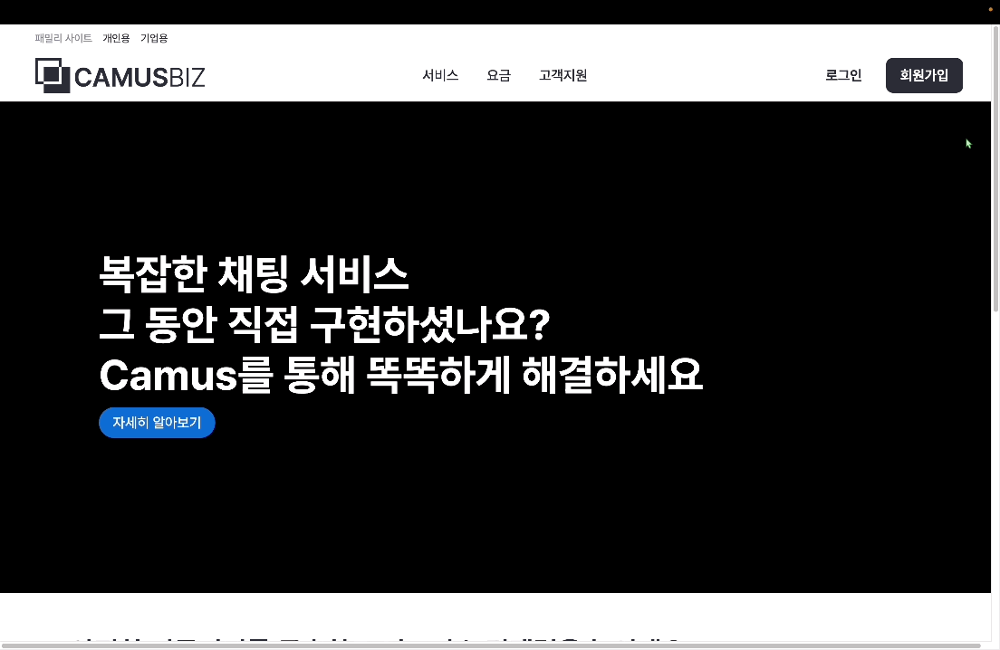
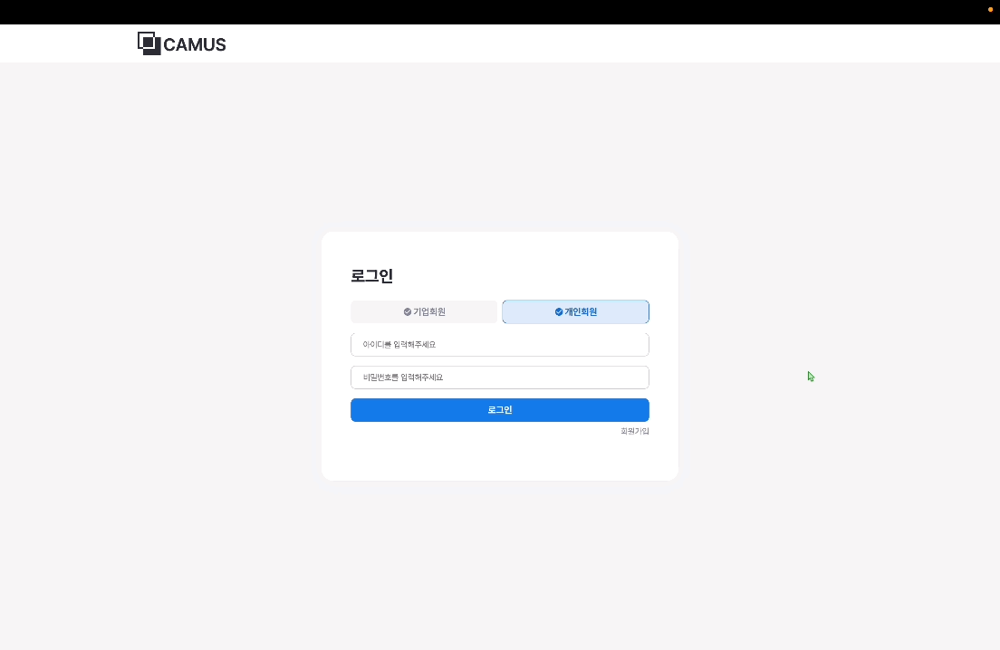
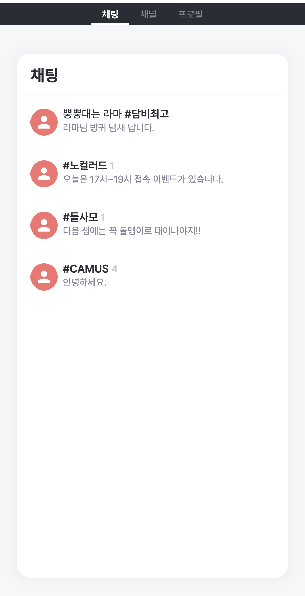
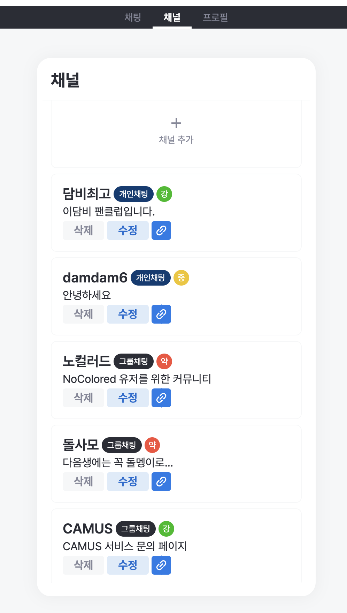
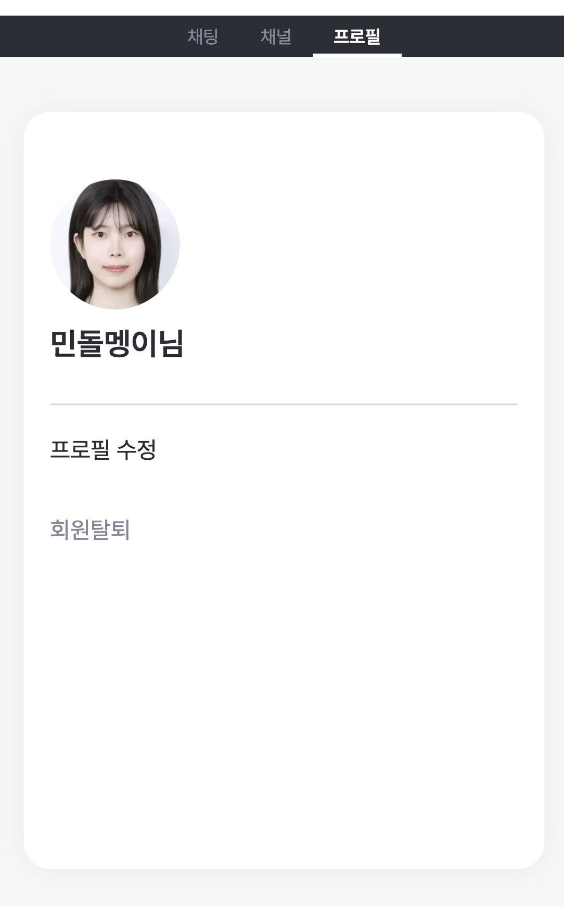
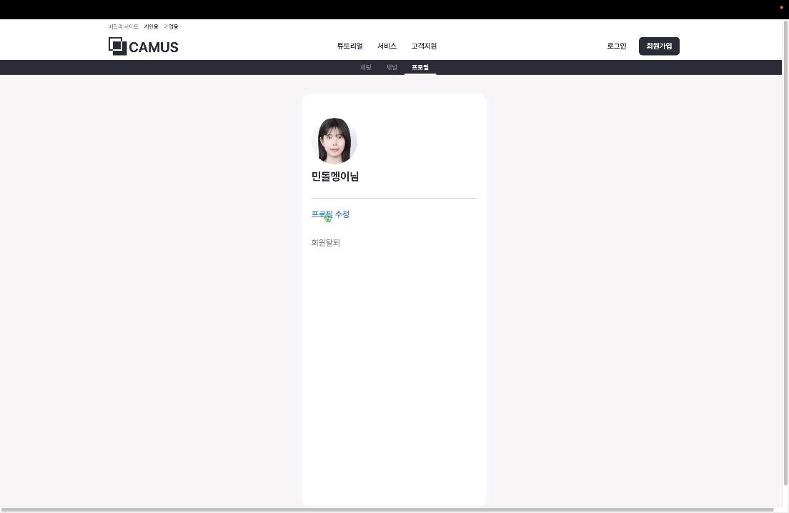
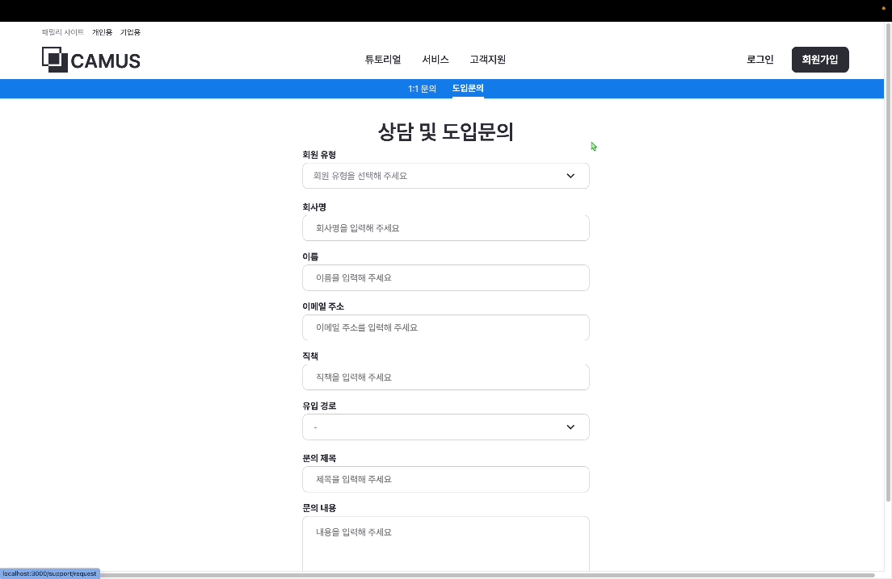

## 💬 프로젝트 소개

### AI 맞춤형 대규모 채팅 솔루션

AI 기반 텍스트, 문맥 분석을 통한 SafeChat 시스템을 제공한다.

필터링 기준의 옵션화를 통해 채팅 필터의 다변화 서비스를 제공한다.

---

## 📚 목차

- [🎯 기획 배경](#plans)
- [🙇 팀원 소개](#members)
- [🔨 기술 스택](#skills)
- [🚀 실행 방법 및 배포 주소](#installation)
- [💡 주요 기능 및 역할](#features)

---

<a name="plans"></a>

## 🎯 기획 배경

<!-- TODO: notion - 기획서 - 기획 배경 참고, 변경 필요 -->

- 강력한 AI 모델이 등장했으나 기존 기업의 AI 도입은 늦어지고 있다. 이는 비용, 전문가부재, 데이터부족, 기존시스템과의 비호환에서 비롯된다. 따라서 **보편적 서비스에 AI를 도입한 기업용 솔루션**의 필요성이 높아지고 있는 시점이다.
- 가장 보편적인 서비스인 채팅에 AI를 도입하여, 필터링 기능을 발전시키고 이러한 서비스를 기존 서비스에 도입할 수 있도록 가공한 프로덕트를 제작하는 것이 목표이다.

---

<a name="members"></a>

## 🙇 팀원 소개

|           [김세진](https://github.com/nijesmik)           |          [전민정](https://github.com/dolmeengii)          | 
| :--------------------------------------------------------: | :----------------------------------------------------: |
|  |  | 

---

<a name="skills"></a>

## 🔨 기술 스택

- Language: Typescript
- Core: Next 14.2.0
- Styling: Sass(Scss)
- State: Zustand

---

<a name="installation"></a>

## 🚀 실행 방법 및 배포 주소

```
// 패키지 라이브러리 설치
npm install

// 개발 환경 실행
npm run dev

// 빌드 파일 생성
npm run build
```

- 📱 front-domain : https://www.camus.life, https://biz.camus.life
- 🛠 back-server : https://api.camus.life
- 🔗 back-swagger : https://api.camuse.life/swagger-ui/index.html

---

<a name="features"></a>

## 💡 주요 기능 및 역할

### 🖥️ 랜딩 페이지 - `전민정`

|                    개인 회원                     |                      기업 회원                       |
|:--------------------------------------------:|:------------------------------------------------:|
|  |  |


### 🔑 로그인 페이지 - `전민정`

|                         로그인                         |
|:---------------------------------------------------:|
|  |

### 👤 회원 가입 페이지 - `전민정`

|                        개인 회원                         |                      기업회원                       |
|:----------------------------------------------------:|:-----------------------------------------------:|
|  |  |

### 🧾 튜토리얼 페이지- `전민정`

|                         채널 생성                         |                        필터링 강도                        |
|:-----------------------------------------------------:|:----------------------------------------------------:|
|  |  |

### 🙋‍♂️ 채팅 페이지 - `김세진`

|                       채팅 리스트                       |                     채팅 방                      |
|:--------------------------------------------------:|:---------------------------------------------:|
|  |  |


### 🕊️ 채널 관리 페이지 - `김세진`

|                      채널 리스트                       |                        채널 생성                        |
|:-------------------------------------------------:|:---------------------------------------------------:|
|  |  | 

|                        채널 수정                        |                     채널 링크 공유                      |
|:---------------------------------------------------:|:-------------------------------------------------:|
|  |  |


### 🗂️ 프로필 페이지 - `전민정`, `김세진`

|                        프로필                        |                       프로필 수정                        |
|:-------------------------------------------------:|:---------------------------------------------------:|
|  |  |

### ⚙️ 문의하기 페이지 - `전민정`

|                        일반 문의                        |                        도입 문의                         |
|:---------------------------------------------------:|:----------------------------------------------------:|
|  |  |

[//]: # (### 🃏 docs 페이지 - `전민정`)

[//]: # (| 서비스 소개 | 서비스 사용 가이드 | REST API | Java Script |)

[//]: # (|:------:|:----------:|:--------:|:-----------:|)

[//]: # (|  |)


### 🧾 요금 페이지 - `전민정`

|                    요금 소개                    |
|:-------------------------------------------:|
|  |

### 📂 폴더 구조 및 아키텍처 설계 - `김세진`

```
.
├── public
│   ├── animations
│   ├── fonts
│   └── images
└── src
    ├── app
    ├── components
    ├── containers
    ├── hooks
    ├── lib
    ├── states
    ├── styles
    └── types
```